# Prediction Modelling as a Tool for Comorbidity Prevention and Harm Reduction
## Abstract
Comorbidity is a condition that effects up to 25% of the population. It means that someone has multiple co-morbid diagnoses that include: liver or kidney disease, diabetes, COPD, stroke, heart disease or failure, cancer, AIDS, and more. Comorbidity is often measured in clinical settings using a Charlson Comorbidity Index (CCI): A weighted index to predict risk of death within 1 year of hospitalization for patients with specific comorbid conditions. Comorbidity is often more than just a consequence of someone not taking care of their personal health or engaging in unhealthy habits. Comorbid conditions are often a product of the built environment and one’s social positioning, including but not limited to: housing quality/security, access to reliable transportation, labor conditions, access to nutritious foods, proximity to biohazardous environments, and exposure to climate change. Using NAIP imagery, Land Cover Index and Green Leaf Index were collected for each tract in Philadelphia and regressed onto the comorbidity rate. Land Cover Index, used as a heat proxy, showed statistically significant. And with a combination of other ACS variables, was used to develop a threshold that best predicts where an FQHC would be the best served to proactively manage comobridity as a public health risk. The neighborhood of choice resulted in Overbrook as the most at risk of worsening comorbidity, with heat and other environmental factors as highly predictive influences. 

## Introducing the Data

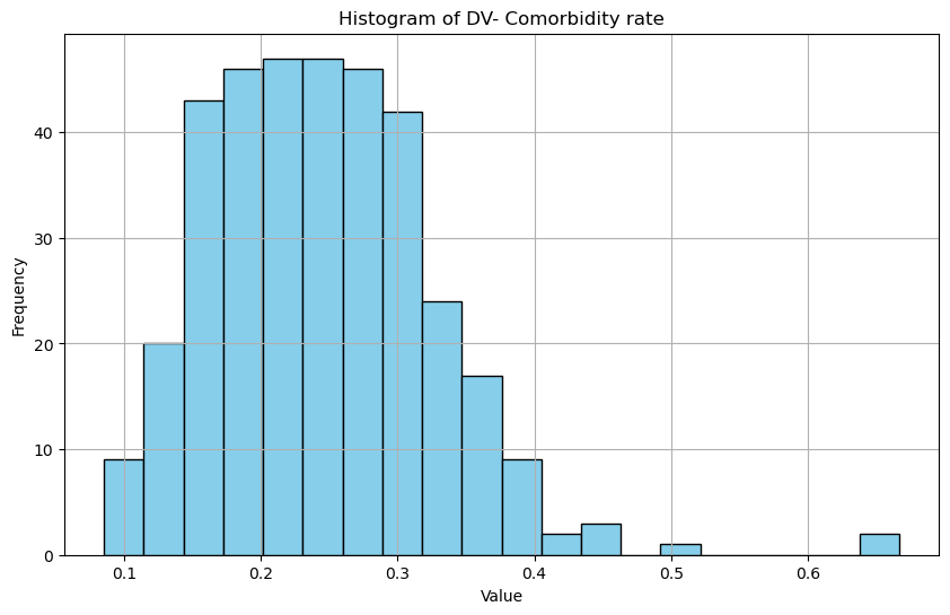
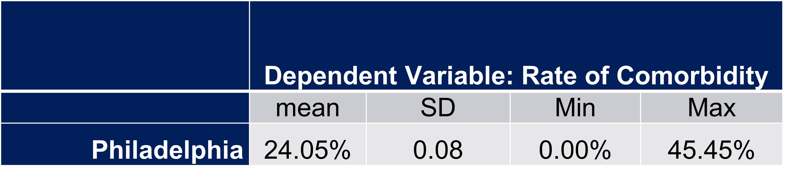
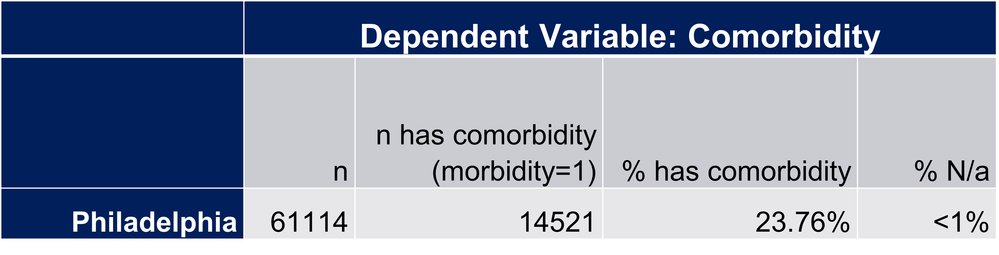

## Methodology
NAIP imagery of Philadelphia was analyzed using Python and machine learning to calculate the Land cover Index and Green Leaf Index. In order to predict a tract that is not already being served by an FQHC, a buffer was created at 1/4 a mile surrounding each FQHC location. The indicies were regressed onto the comorbidity rate to determine which metric should beused to guide the FQHC model prediction and recommendation. 

### Buffer
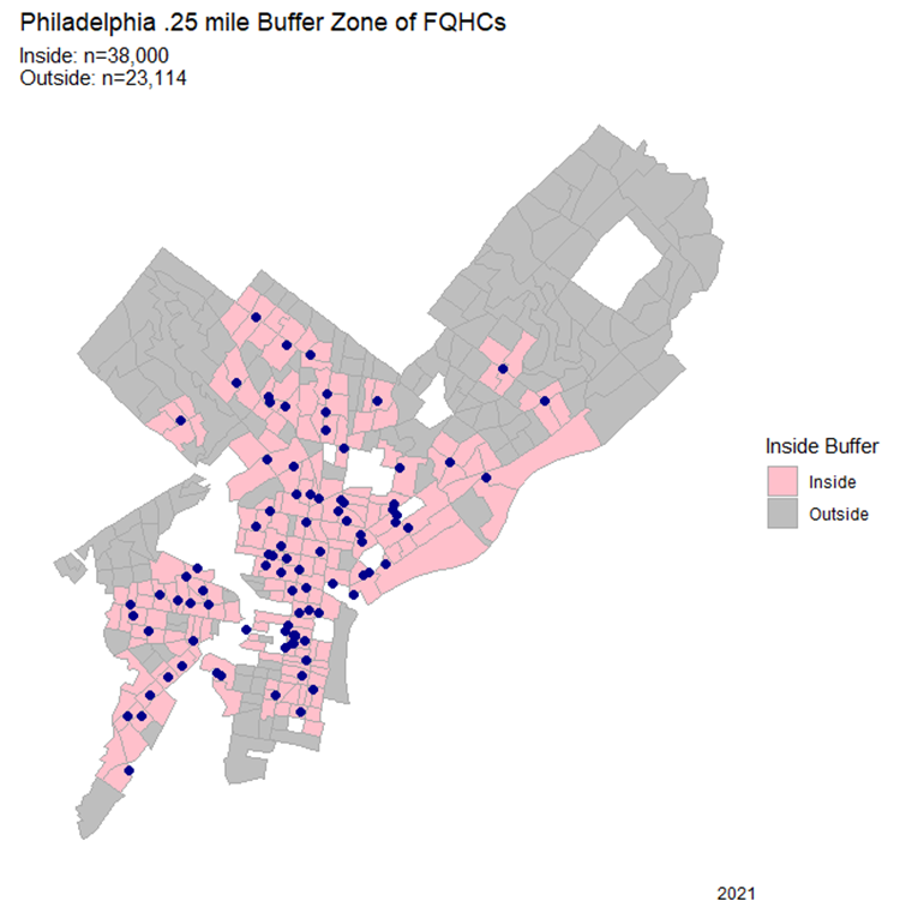

### NAIP

#### Green Leaf Index = (G - R) / (G + R + 1e-5)  
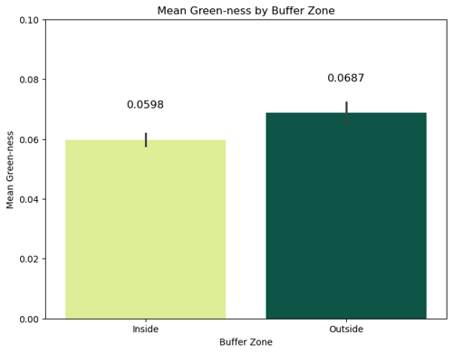
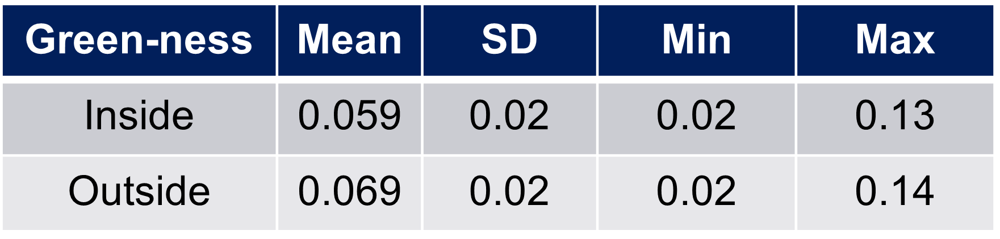
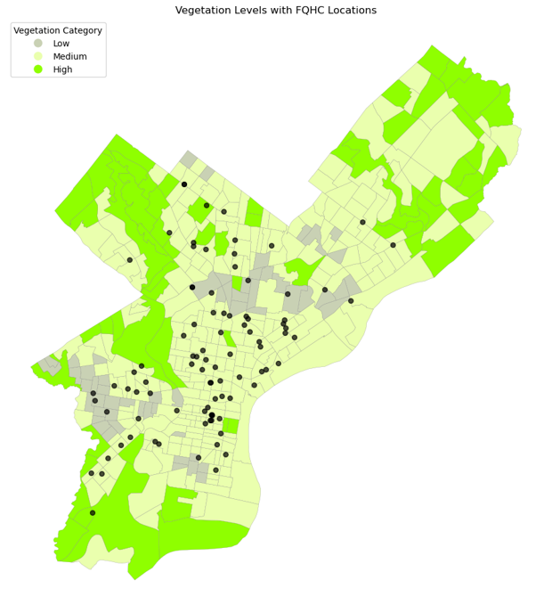

#### Land Cover Index= (R + G - B) / (R + G + B + 1e-6) 
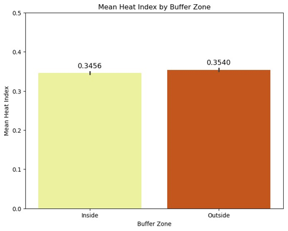
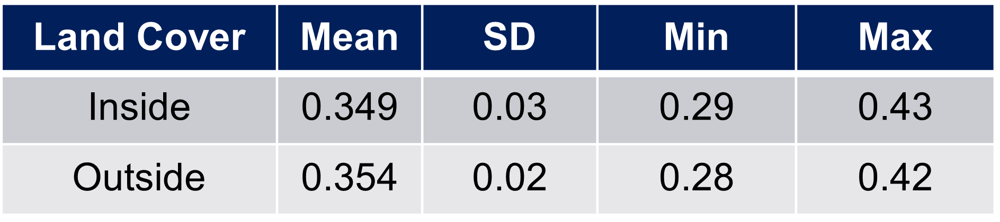
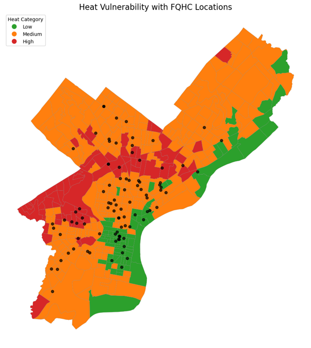

### Regression
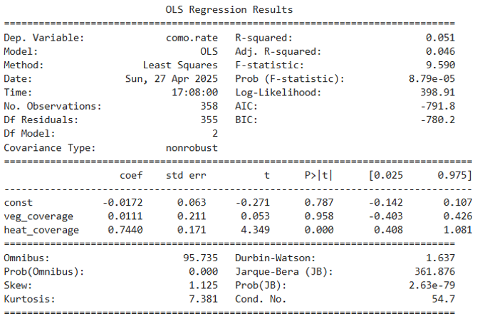

The Land cover Index, aka heat_coverage, comes back statistically significant with a p-value of < 0.05. This variable will be used for the final prediction since over-exposure to heat is an agitator for certain comorbid conditions like COPD or stroke. 

### Ask yourself: 
#### Are low-cost neighborhoods settled by vulnerable populations because environmental risk from urban development reduces property value first  
or  
#### Does Urban development subject vulnerable populations to undue environmental burden first and then their neighborhoods lose value after?

## Results
Using machine learning, the following tracts were identified with the following treshold: 
- Outside of buffer variable
- Land Cover Index > 0.375 (Top quartile)
- Model Predicted Comorbidity Rate (Top quartile)
- Population >0
- Rate of poverty > 20% (Top quartile)
- Black poulation > 40% (Top quartile)
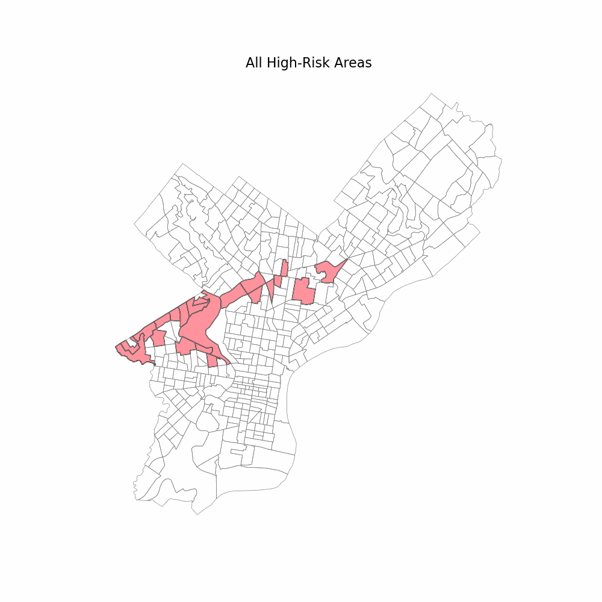

## Conclusion
Although the threshold identified three suitable choices for a new FQHC location, Overbrook would be my highest recommendation as a highly valuable and historic neighborhood who is deserving of the most investment, both from the persepctive of public health, and general social acceleration. Click the link for an interactive map that presents the attribute variables for the top 3 choices. 

